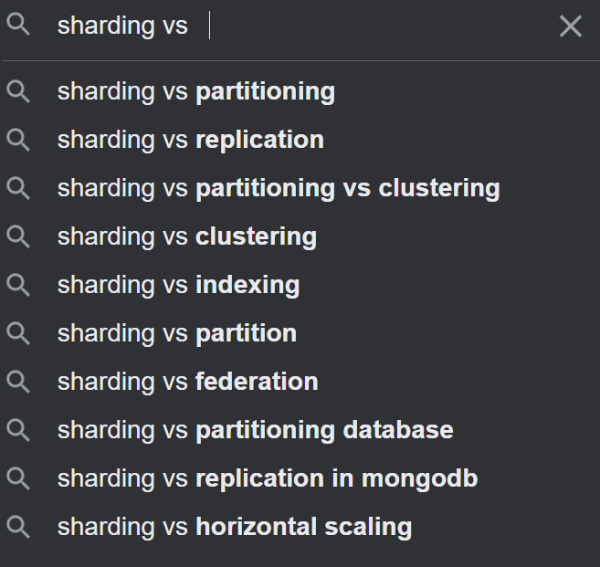

# CICD

그들은 CICD 분야에서 공통적으로 활용되고, 워크플로우를 제어한다는 공통점이 있습니다. 
It seems they work on CI/CD boundary, also about workflow controlling tool. 

(ChatGPT 참고)

---

비슷한 컨셉들의 영역을 구분하고 싶다.

어떠한 차이점이 있으며 서로간의 상관관계나 포함관계를 알고 싶습니다.

What other kinds of Services are there?
또 어떤 종류의 서비스가 있나요?

그것은 어떻게 서비스 라는 개념과 연결되나요?

각각을 따로 사용하는 케이스가 있나요?

Then why are they called seperately? Is there a case where each is used separately?

Ok, then as you said, when refering ingress resources, each might have different hostnames and paths so that they might be different services, why do I need ingress and controller?
-- 이건 이제 안물어봐도 될것 같은 바보같은 질문, 그냥 라우터 같은데.
-- 간단히 말하면 라우터의 라우터, 한단계 더 추상화된 메타 라우터...

---
샤딩?

샤딩이 멀티스레드랑 다를게 뭐지?

[[sharding.png]]

로컬확장이 아니라 클라우드를 통한 수평확장의 한 형태였음.
클러스터 컴퓨팅으로도 보이는군요.
it looks like distributed cluster computing.

---
쿠버네티스의 역할

쿠버네티스를 실습해보면서 느낀 점은 쿠버네티스랑 루드 도입하면 로드 밸런싱 자동으로 해주고 클라우드 가용성도 자동으로 유지해 주니까 서비스 제공하기에 좋겠다라는 생각을 함

쿠버네티스가 롤 젤러스를 어떻게 제공하는지 커티스에서 서비스랑 디플레이먼트가 있는데 서비스가 서비스 엔드 포인트 느낌으로 해서 로드 밸런스 역할을 해주고 디플레이먼트가 컨테이너들의 가용성를 조절해 주는 스크립트를 짤 수 있음

쿠버네티스가 무엇인지 아는 것을 활용해 본 것에 대한 기준인지 질문을 드려보겠음

작업하는 데 얼마나 걸렸는지 데모 정도 수준이라 이틀 정도 걸렸고 혼자 개발을 했음