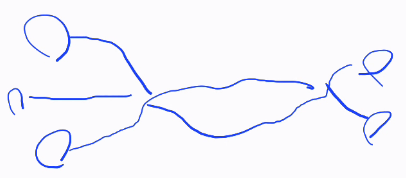

# 그래프 기반 언어

How to define function in RDF context?
_> Why we need this? Or html node.

뉴런, 수상돌기, 덴드론? 처럼 
노드와 그래프를 확장하면 위와같이 함수라는 관계성을 나타낼수있다.
표현방식은 
가운데 노드 먼저 , 그에 따른 결과, 그리고 들어가는 파라미터로 한다
다른 일반적인 노드들도 가운데 선을 먼저, 도착노드, 시작 노드 순서로 한다
즉 엣지의 종류가 2개가 된것

그럼 그것도 그냥 객체지향? 처럼 함수만 모아놓은 객체로 표현해서 노드화 시키면?
이 노드는 대신 항상 입력 출력 노드가 존재하는거고.. 그냥 has value 나 void? 같은거면 아웃풋은 따로 없을거고 인풋 없고 아웃풋만 있을수도 있지
그래프로 표현은 가능해.

그러면 이걸 기존 turtle 문법처럼 자연어처럼 쓰되 프롤로그나 머큐리 같이 여러 인자도 받을수 있게 하면 되는데 이건 하스켈을 좀 참고하면 괄호없이 쓸수 있을거 같은데
괄호 없는 언어가 드물걸?

파라미터가 필요한 함수는 스스로 독립적이지 않고 무언가 필요한 부족한 함수
목적어가 필요한 동사로 볼수 있을까

결국 문제는 주어의 위치
처음에 넣을것인가 마지막에 넣을것인가
함수 실행의 주체 말이야

주어는 결국 링크일거고 
리소스도 마찬가지겠지

서비스 관리주체 혹은 개인 블로그 등이 어떤 데이터나 에셋 자체 혹은 링크를 들고 있을거고

Activity isFunctionOf
    Aarg
    Barg
    Carg ;
    returnedTo
    Dres .
?

어떤함수 가지고있다
    가
    나
    나;
         반환한다
    라
    마
.

모듈은 어떻게 배포되고 그 운영 주체,단체,기관,법인은 어떻게 기록될수있나? 
그러면 그것도 그냥 리소스가 되는것 아닌가
기존 링크 기반 리소스에 위배되지않아? 동사는 못쓴다면서.

일단 링크식으로 접근하려면 repo가 앞에 오는게 낫긴할거같고 자연스럽게, 아니면 작동 함수 먼저 쓰면 그거 다 쿼리하려면 오래걸리잖아. 
로컬 범위가 작아지도록 하는게 낫긴해.
그러면 인덱싱? 쿼리 범위가 줄어들고..

그러면 리소스나 그런건 ~김철수:이미지 이렇게 쓴다 치고 함수는? 

엣지라는 프로퍼티는 보통의 경우는 어떤 온톨로지에서 클래스나 대상의 값만 표시해주고 노드 하나랑 연결하잖아.

함수는 여러 노드를 가질수도 있으니 그걸 묶는다고 치면 
일단 지금도 정의는 그냥 하나의 온톨로지에 묶여있잖아. 필드같은걸로 나누고. 기존 객체지향처럼.

근데 기존 패턴매칭이나 함수형에서 처럼
그냥 다 하나 또는 여러개로 정의하고 그냥 다 함수로 생각하는것도 나쁘진 않은데 

Http링크는 슬래시로 구분되고.. 근데 그것도 사실 (아예 하위레이어로 두는 방법도 있고) 
그위에 어떤 앱 프로토콜 정의하고 유저 아이디로 간소화해서 접근한다거나 하면 되긴하는데 

메인함수처럼 엔트리, 인덱스로 사용할부분에 적힌걸로 링크타고 들어가는건 구글에서 페이지 링크 알고리즘이랑 같지않나. 
근데 그게 정석적이긴 한거같고..

그니까 지금 헷갈리는건 함수 표현할때 타고 들어가는거랑 
파일 path를 동일한 표현식으로 쓸거냐 이거 아닌가? 

파일 stream or blob 을 리턴하면 하나의 노드 공간에 저장할수 있겠지.
함수를 어떤 저장 공간에서 바이너리를 불러서 사용할수 있겠지.
저장공간이라는게 포인트아닐까.

파일이라는건 어떤 고정된 데이터를 반환하는 함수인건가 변환이나 수정을 하면 다른 파일을 뱉는 함수를 만들순 있겠지

함수 기반의 링크는 뭔가 다른가?
리소스를 꼭 서술해야하나?
파일의 메타데이터에 포맷을 추가하거나 포함되게하면 런타임에 에러가 날수있나? 근데 뭐 똑같지 차라리 컴파일 타임에 (파일생성할때) 검증되도록 해서 해시값도 필드에 추가하는게 더 안전한 방식이지 지금처럼 파일 명에만 확장자가 붙는 방식보다는.

즉 노드라는건 어떤 모듈이 되고
그게 단일 파일을 부르는 함수가 있을수도 있고 
어떤 메타정보를 나타내는 함수를 넣을수도 있다?
다른 목적어가 필요한 함수도 정의할수 있고..
즉 그 "파일" 이라는건 정적 이미지 일수도 있고 함수가 정의 될수도 있는데 (물론 어떤 인터프리터 언어거나 컴구조 최적화 한다고 해도 암튼 컴파일 언어겠지) 그런 바이너리나 암튼 무언가 바이트, 문자열을 지정해놓으면 

연결은 어떻게 표현하나?
링크? 그 링크의 표현식은? Turtle?

그러면 그 매칭만 시켜주면... 어떤 요청하면 뭐가 나오게끔 한다던가 일종의 질문 목록이나 챗봇 자동답변같은 개념(좀 다르겠지만) 미리 정해둔 룰이 있으면 그거대로 뱉도록 사용자가 미리 설정해놓으면 (공개 비공개 라든가) 그 자체가 서버를 정의하는 셈일수도. IDL? Interface Definition Language?

그리고, 지식을 만약에 태그 라던가 어떤 지식 베이스 그래프를 구축한 유저가 있다면 이건 딱히 중간 엣지를 정의하진않지만 암묵적 implicit하게 연결이나 관계를 나타내면 되겠지..
어떤 수정을 요하는 작업일때 그 repo에 접근 가능한지 체크는 해야해. 결국 유저를 어떻게든 쓰긴해야해 호출 주체. 처음에 적을까 끝에 적을까. 뭐가 좋을까?
_> 

기존 url 방식 말고 그래프 쿼리 포털로 해서 자기만의 포털에서 쿼리하면 오른쪽 그래프 형태로 카드뷰가 나오고 미리보기 클릭하면 사이트 이동. 검색 포털 없이 분산 해시테이블 쿼리로 상호 연결.
처음 검색하거나 연결 안되있으면 평판이나 좋아요 점수 등으로 평가
