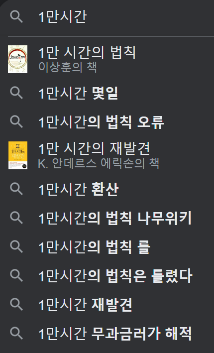

# 블록체인 DID
DID를 이용하면 해당 주소의 service endpoint 노출이 가능하고, 컨트랙트 메타데이터를 첨부하면 관련 네트워크의 라우팅 해시 테이블 등을 참조해서 RPC 요청을 통해 함수 실행도 가능하다. 

즉 어떤 API 호출이 가능하고, 데이터를 넘기고, 실행하고, 그 반대의 경우도, 블록체인 상의 이벤트 리스닝이나 어떤 데이터 토싱, 전달 방법에 의해 가능하다. 

어떤 사정에 의해 여러 블록체인을 사용하더라도 Solidity EVM 이든 MoveVM 이든 WASM 이든, 각각 Consensus layer는 다르겠지만 컨트랙트의 호출은 어느정도 호환이 가능한 산업 표준이 형성되는 듯 하다. 

---
내가 하려는 것은 이런 일이기 보다는 적당한 체인을 골라서, o1js(snarkyJS)나 MoveVM 이나 영지식이나 적당한 퍼포먼스가 있는 메인넷과 IPFS 또는 Holochain 또는 Hashgraph(뭔가 이슈가 있었던것 같은데, BFT가 힘들다거나) 또는 Freenet(old: Locutus) 을 사용해서 직접 민주주의를 구현하고, 경제 시스템을 자동화해서 경제 평화에 기여하는 것이다. 

세상에서는 누구나 잘될수가 없다. 경쟁이나 빚을 이용한 시스템에서는 당연히 대중에 도움이 되고 득이 되는 공리주의적인 만인 평등 저비용 고효율이 항상 이긴다. 
시스템은 점차 효율화되면서 작아지고 불평등과 격차가 반드시 발생한다.
나쁘다는 것이 아니라 이러한 시스템을 안정화 시키기 위해서는 추가적인 요소가 고려되어야한다는 것이다. 
화폐 시스템은 주권에서부터 비롯되어야하며, 누구에게나 주어진 시간을 기준으로 생성되어야한다. 
또한, 해당 커뮤니티를 위한 일로 인해 화폐가 생성되어야한다. 
단지 대의 민주제에 의한 대표의 지도 혹은 경영 원칙이나 결정에 의해 화폐 발행이 결정되어선 안된다. 화폐 흐름 그 자체는 자연스러워야하며 누구에 의해서도 컨트롤 되어선 안된다. 
다만 우리 공동체가 올바른 방향으로 나아가기위해서 공공선을 위한 규칙을 만드는 것이고 그 첫번째가 공공선을 위한 영향력이 있을경우 화폐를 생성하는 것이다. 
이를 위해 다음과 같은 감지 체계를 상정해볼수 있다: 
좋아요 라던가 투표수 같은 데이터를 도입하여 영향력을 정량화하여 측정할수 있다. 
당연히 100퍼센트 만장일치는 불가능하지만 일부 선택적 세금 환원에 따른 돈을 생성할수 있다? 또는 상대적인 수치에 따라 생성할수 있겠다. 
생성에 관해서는 항상 명시적이고 자세하게 기록된다. 커뮤니티의 운영 그룹에 회부되며 기록과 증거가 커뮤니티에서 합의된 운영규칙과 행정, 정관 등에 따라 법리적으로 해석되고 추후 결과에 따라 회수되거나 추가지급 될수 있다. 하지만 이는 결과적으로 기존 제도와 비슷해지기 때문에 상대적 수치를 지급하는게 나을수도 있으나 사이비 교단이라든지 일방적인 절대다수를 동원하는 좋지 못한 일이 발생할수도 있기 때문에 어느정도의 견제 수단이 필요하다. 이는 열린 해결법으로 커뮤니티의 제안을 기다린다. 

---
#zk #zkp #zero-knowledge #영지식
이것과 증명서킷의 프론트엔드 백엔드의 개념은 서로 어떻게 연결되나요?

universal trusted setup 이 있다는 것은 알고 있습니다. 어떻게 universal circuit이 가능하나요? 
혹시 용어를 헷갈리게 사용하나요? 

서킷이라는건 특정 애플리케이션 로직을 시뮬레이션하는 모델로 알고 있습니다. 같은 논리를 가져야합니다. 스도쿠가 맞는지 체크하려면 서킷도  스도쿠 로직을 가져야 합니다. 어떻게 범용 서킷이 가능하나요? 우리에게는 여러 기능을 가진 범용 계산기는 있습니다. 그런 식인가요? 

---
it is not a blockchain anymore, isn't it? 그건 더이상 블록체인이 아니지 않나요? 
(zk rollup? use blockchain as a trust anchor only, but still it is a blockchain.)

---

zk rollup use blockchain as trust anchor. so I think, hard fork will be easier, if all transaction is made of proofs only, because ... no, substrate 는 wasm 이니까 가능한것...?

---
isOld0
어떤 목적을 위해 존재할까요?
SMTProcessor
이전 값이 0이면 true, 
0이 아니면 false
아마 예전에 circom 강의듣다가 기억난건데 언어적 특징으로 0과 관련된 연산 처리인가 무한대 처리를 잘 못했던 것 같아. 그래서 이전 값이 0일 경우는 따로 처리하는 것 같아. 
잘못되는 계산되는 상황이 발생하지않도록 플래그를 만들어서 에러처리를 한것 같음. 
아닌가 다시 강의를 보니 inverse assign 처리도 잘 되는것 같음.
그냥 동작 설정에 대해서 연산을 생략하는 스위치 용도 일수도 있음.

---
2024-02-25T16:25:59+09:00
오후 6시 영지식 정리되면 (hackernoon)
라즈베리파이, os sd카드에 이미징 하는 방법 찾고 어떤 os할지 찾기

freenet (holochain도 아이디어만 따고 일단 요구 리소스가 좀 많음)
ipfs (arweave는 별로, 토큰 파는거나 등등 느낌이 별로.)
openmina 

bullshark 

arbiter
freenet locutus ipfs holochain bullshark dag-rider
arweave ipfs bullshark dag-rider
arweave dag-rider contract

---
일단 15번이라는 연가를 고려하면 
원래 했던 가정을 적용했을시 
주말포함해서 11시간이 비고, 총 165시간이 더 필요함.
52주에서 15를 빼면 37이 나오고 주당 4.46시간 보충... 
평일에 쓰기엔 어려웠고 1시간도 간당간당했어. 머리로만 계산했었나..
15분을 어떻게든 2번 만들어서 30분씩 뽑아내면 평일 2.5시간이 추가로 나옴. 그러면 주말에 2시간, 즉 1시간씩은 넣어야겠다 이렇게 생각하고 있었는데, 일단 현실적으로 주말에는 쉬기도 해야하고 운동도, 집안일도 데이트도 이것저것 눈 돌리려면 6시간은 굉장히 힘든 숫자긴해. 
그래서 일단 마지노선을 정하자. 3시간. 
그 이상 쓰기가 어려워. 그것조차도 사실 일상적으로 자기전 1시간반, 아침 1시간반 이정도야. 
즉 주말 합쳐서 가용 시간은 6시간으로 고정하자. 
평일 5시간+자투리시간 긁어모아서 7시간반, 주말도 뭐 자투리 시간을 긁어서 15분씩 4번 모아서 7시간을 만든다고 가정하면 주당 총 가용시간 14.5시간.
이러면 기존 15시간에 비해서도 준수하네. 
문제는 이제는 더이상 늘리기 불가능하다는점. 연가쓸때의 165시간은 보충이 불가능. 주당 4.5시간을 추가로 만들수가 없어. 평일은 1.5, 주말은 3.5를 만들어봤지, 아침시간을 활용하는 수밖에는 없는데 내가 그렇게 부지런할수있을까. 사실상 그게 아니면 4.5는 불가능하거든. 영구적 손해지뭐. 
즉, 연가인 주를 제외하면 아침을 굉장히 부지런하게 살아야한다는거야. 그거 말고 시간을 만들만한게 뭐없잖아. 주말은 이 수치 이상 내기 어렵고. 
답이 없어. 연가를 쓸때 정말 1시간씩이라도 쓸수있다면 혹은 30분이라도 쓸수있다면? 아무리 그래도 ... 아 지금은 가용시간을 확 줄였으니 가정이 바뀌나 주말은 7시간이지? 주말에 과도한 양이 배정되었는데 이렇게 바뀌면, 8.5시간이네 0.5 빼면 주당 8시간 부족. 즉 120시간만 채우면되고 3.2 시간이니까 대충 하루에 .5 씩 추가한 일주일을 살면되긴하네... 수치상으로는. 
즉 연가 주는 평일 2, 주말 4를 채우는 삶을 살면 
어쨌거나 14.5시간을 만들어낼수있어. 

자 그러면 최종적으로 6,032시간이 8년간 업무외 시간으로 만들어낼수있는 시간이고, 사이드 프로젝트로 충분한 시간이 되고 조금만 노력해도 도달 가능하고, 절대 불가능하진 않은 계획이라는걸 알았어. 

업무적으로는? 주간 40시간씩 52주, 연가 15일을 제외해서 
매년 2080-120=1960시간
주니어 3년이면 5880이라는 어마어마한 시간임.
이미 이것만으로도 10040시간이라는 전문가 시간이 나옴.

기계적인 연습이 아닌, 의식적인 연습(deliberate practice)을 지속했다. 의식적인 연습이란 집중과 피드백, 수정으로 요약되는 연습, 즉 시행착오를 통해 개선점을 찾아나가는 연습을 말한다. 비범한 재능의 뒤에는 꾸준함이 아니라 체계적이고 과학적인 훈련이 있었다는 이야기

어쨌거나 투자가능한 시간을 재는건 필요해. 그래야 수치적이고 정량적인 가늠이 되고, 그게 내 자산이자 시간이 무한하다고 여기지 못하게되서 시간을 아끼고, 낭비하지 않을수가 있거든. 
시간이 많냐? 밤새는것도 사실 안좋아. 시간이 많다는 착각이 생기니까. 펄레펄레 놀다가 이때가 되야 집중이 되버려서 어쩔수는 없지만.
그래서 데드라인을 정하고, 혹은 경험치같은것으로 시각화를 하는것도 방법이지. 오늘 이것밖에 못했나 이런식으로. 

아무튼 780*3=2340을 기준으로 세운 계획을 수정해보자. 
주간 40을 가정하면 780시간은 19.5주, 약 4.5개월이야.

2340은 58.5주가 나와. 업무외 계획을 업무시간으로 환산하면 1년정도면 끝난다는거지. 정확히는 1년하고도 1.5개월.

근데, 업무시간에 기초강의 듣는것도 좀 이상하고, 업무시간은 오전 조금 퇴근전 조금해서 2시간정도를 쓴다고만 생각하면 주당 10시간이거든. 그니까 내가 업무외시간은 회사를 위해 쓴다고 생각하고 주간 10시간 정도 벌어낼수 있다는 거임. 
그정도면 모자라진 않겠지... 경제 공부할 시간은 있어야될거같아서. 
가능하다면, 14.5를 만들어본다면 주간 매일 2.9시간, 174분을 만들어볼수 있을까? 출근하고 1시간, 점심시간 0.9시간 약 54분, 퇴근전 1시간? 가능해? 
그러면 일하는 시간이 8시간 가정하고 5시간정도 밖에 안되는데? 뭐 근데 어차피 그 공부라는 것도 업무의 연장이라고 볼수 있고 도움이 되니... 

1.5라고 했던 업무외학습을 업무중 3으로 늘리는... 짓을 해야 내 개인 프로젝트가 가능하니까. 
근데 그건 회사 사정에 따라 달라질수도 있음. 즉, 매번 달성못할수도 있음. 내 자유가 아니니까. 
전문가로서 커리어도 중요하니까... 어쩌지...

지속가능하려면 이 이상 시간을 늘리기는 어렵고, 
아무튼 어떻게든 해보자. 방법은 없어. 그냥 꾸준히 책보자. 
15분 2번을 추가로 만들어내면 30분이고 
5일이면 2.5시간, 
일주일이면 3.5시간, 
이걸로는 14.5시간 못만들지. 
29번의 30분...
5일이면 하루에 5.8번, 6번, 즉 밥먹을때, 자기전, 
근데 이건 1.5, 심지어 연가로 모자란 부분 채우려면 2를 매일 채운다는 가정하에, 그 외 시간에서 만들어야해. 

차라리 29번이면 평일에 2번씩 10번, 주말에 9번씩 18번해서 28번까지는 가능할지도? 9번이면 4.5시간이야 가능하긴개뿔... 주말도 2번 더하는게 한계지. 
즉 아무리 늘려도 총 14번이고, 업무외 사이드 프로젝트하려면 15번이 모자란거임. 7.5시간. 일주일에 하루가 더 있지않는한 불가능함. 윤년은 4년에 한번이니 불가능하지. 

그냥 7.5시간 모자라다고 치고 52주면 390시간, 
3년이면 1170시간, 여유분 감안해도 1천 시간이 부족하네. 
업무중 2시간을 짬낼수있다고 가정하고 3일간 6시간만, 그날은 30분 못달성한다치고 1.5제외 총 4.5시간을 확보할수있다면 부족시간은 3시간으로 확줄어. 1년156시간에 3년468시간. 
여유분 192시간 감안하면 276시간 남음. 19주, 4.4달가량.

결국 그냥 조금더 딜레이 되긴해도 그거 감안해야겠다. 
1주에 15분씩 3년이면 0.6달 단축이돼.
1주에 25분씩 1년이면 0.34달 단축이고, 
1주에 35분씩 1년이면 0.48달 단축이야. 
얼마나 시간이 소중한지 알겠니. 
하루 5분을 만들면 나중에 2주를 단축시킬수있어. 

1. 슬라이드 내용 정리
2. pionj 전체확인
3. cvdraft 확인✅
4. 갤노트 확인✅

시간 계산 다시, 경제 프로젝트 넣어서, 업무시간에 암호학넣고... 재분배.
시간 계산 잘해보고, 기존 업무외시간을 업무시간으로 좀 넣고, 이제 내 프로젝트 실현이 가능할지를 주로 생각해보기✅

캐치 ai면접 리스트도 확인✅
임시메일도 확인✅

pdf 로 백서를 확인했었지만 한번 시작하려면 제대로 해야한다는 마음이 있어서 완전히 이해하지는 못했었다. 당시에는 학과 공부나 창업 관련된 내용에만 몰두했었다. 
