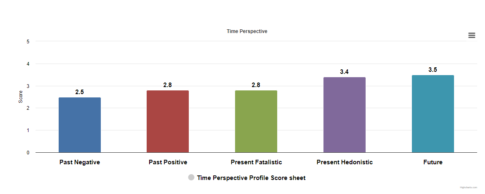

# 2024-01-20 (January | Saturday)

  

잘한일, 칭찬
- 할머니와 전화, 일찍 끊어서 다시 전화, 웃게 만들어드림, 이제 김치 많이 안보내도 된다고, 알아서 먹고 산다고.
- 루틴 다시 세움, 시간 계획 세움. 시간의 소중함 다시 깨달음. 일찍 일어나는 자체가 시간을 버는일.
- 허리가 아파서 집안을 좀 걸어다님, 살짝 복싱 연습도 함.
- 설거지함.

못한일, 반성
- 늦게일어남
- 그래서 할머니 전화 일찍 끊음.
- 점심 안먹고 3시쯤되서 점심 식사 끝냄
- 중간중간 백종원 장사천재 봄
- 가끔 핸드폰에 신경 뺏겨서 집중 못함, 딱히 뭘 한것도 아님. 그냥 만짐. 
- 생산성 계획 세운다고 또 너무 시간 씀. 정작 해야할 이력서 정리 많이 못함.

각오
- 남은 2시간 알차게 잘 썼을 것이다.
- 마미한테 전화를 잘 마무리 했을 것이다.
- 내일 할일 정리하자. (미래완료형 익숙해지자) 정리가 잘 끝났을 예정이다.
- 결과가 아닌 과정을 이미지 트레이닝, 데드라인 만들기(이렇게 메모하고 일기 쓰면서 반성, due date, estim hour 만들기, duration 측정 결과 분석), 정확히는 데드라인보다 매일 할일(TODO)을 단위화, 원자화하고 목표 완성도? 같은게 필요함.
- 문제가 생겨서 계획을 수정해야하면 최대한 그 문제를 해결하면서 계획을 할수 있도록 상황을 유도하기, 즉 상황에 통제당하지말고 내가 주체적으로 주도적으로 그 상황을 이끌어가기. 타임라인도 좋고 약속도 좋은데 그러면 여전히 타의에 의한 수동적 태도가 된다. 능동적인 태도를 갖추려면 내 할일에 시간을 맞춘다. 즉 항상 내가 할일이 먼저다. 시간이 아니다. 물론 시간도 중요하다. 시간 약속은 있으니까. 그러니 할일을 정했으면 단위시간을 처음 측정해본다. 그리고나서 언제까지는 끝낼수 있겠다는 계획을 세운다. 그래야 서로 만족할수 있다. 억지로 무리해서 몸을 상하게 해도 결국 나중에 안좋고, 정작 내 프로젝트를 못하게 된다. 그렇다고 너무 대충하거나 철근 뽑듯이 설렁설렁 시간을 제공하면 만족스럽지 못한 거래가 된다. 지속가능한 관계를 유지하고 나도 시간을 잘 쓰려면 단위시간에 맞게끔, 그리고 여유시간을 고려해서 몇 뽀모도로 사이클 정도 필요할것 같은지, 80퍼센트 정도를 생각해서 주자. 계산의 편의성도 있고 만약 못했을 경우라도 매일 2시간씩 20퍼센트를 보충해서 (이게 소위 야근이라는게 되겠지만) 일주일 안에 다시 컨펌을 받자. 물론 일정에 딱 맞아 떨어지면 가장 좋겠지만. 근데 논문도 보통 그렇게 연장하는거 보면 일주일 정도는 적당하지않을까. 하루 연장은 좀 야박하고 다음주까지는 좀 너무 후한가? 중간은 애매하잖아. 3일 4일이 적당하려나. 근데 항상 부족한 부분은 생길수밖에 없고... 일주일에 23퍼센트 정도 한다면 4주에 92퍼센트, 남은 8퍼센트는 2일이면 충분하긴함. 그니까 진짜 1~2퍼센트만 더하면 되긴하네. 22%면 88%, 12는 3일정도.. 21%,84%,남은 16%은 4일정도. 24%,96%,1일만 추가하면됨.
22퍼센트만 할수 있도록하려면... 그냥 집중 잘해야지뭐. 몰입하고. 
뽀모도로 한번 아토믹 집중시간이 30분이면 쉬는시간 제외하고 1퍼센트는 0.3분이거든. 18초야. 딴 생각 잠깐 안하면 되는거지. 
물론 그렇게 해도 오차는 생기고 일이 지연될수는 있지. 많은 변수가 있을테니. 
가능하면 하루의 일을 아토믹하게 정의하고, 일을 하나씩 정리해나갔을때 해야할일을 최대한 함수단위로 쪼개서 
전체 프로젝트에서 해야할 일이 100개라면 일주일에 대략 25개, 하루에 5개잖아. 88퍼센트면 88개 한거고 한주에 22개, 하루에 약 4.4개. 96퍼면 24개/W, 4.8개/D
4.8이냐 4.4냐 4냐에서 갈리는거네. 즉 되도록이면 4개는 무조건 끝내고, 1개는 중간까지만 가도 괜찮은거네. 이렇게 여유잡는건 안좋지만. 아무튼 계산상으로는 그래. 

밥도 준비 20분, 먹는데 30분? 설거지 뒷정리 10분하면 1시간 알차네. 
그 이상 여유를 내는 방법은 자기전 30분 잘 준비 씻는 시간을 줄이거나 (요리나 파티가 쉬고 여유로운 시간일수도 있으니..) 주말에 미리 장을 보고 김밥이나 샌드위치를 만들어놓는 방법이 있을수 있다. 

어차피 다 못기억하니까 핵심적인 부분 딱 4가지만 말할게.
1. 자기전 1시간 하루를 정리하고 내일 할일을 정할것. 그래야 목표가 생기고 침대에서 꼼지락 대지 않을수 있음.
시간 무조건 버세요! 자기전 1시간 무조건 확보하고, 아침에 일어나는것 자체가 시간을 버는 행동·행위·일입니다!

   1-1. 할일은 너무 많지않게 첫날은 단위시간을 재서 뽀모도로 몇사이클이 필요한지 계산한다. (보통 일과시간 기준 하루 3사이클(12뽐)이 최대이고 개인 시간 포함해도 4사이클 겨우 나옴. 즉 하루 3사이클로 보면 됨. 이따가 1시간정도 측정해보기.) 예시: 1사이클에 ~~1.7~~1.6퍼센트(내가 한일을 좀더 작게 말하기) 나옵니다. 1시간에는? 7.5: 8 = 1.7 : 1.813
1시간이면 0.23퍼센트... 3시간에 0.69 좀 이상한데. 
하루 5퍼, 1시간 기준 0.625퍼센트는 해야함. 
비율은 대략 ~~0.367~~0.368 or 0.390 
368곱하는게 좀더 오버페이스이고 그래야 보수적,수비적?매파적?으로 계산가능함. 하지만 내 시간을 여유있게 가지려면 390곱해야함? 뭔가 이상한데. 
금방끝나겠네~ 라고 하면 내가 피곤해지니까 작게 수치를 계산하려면 내가 1.7해서 다 끝냈더라도 0.3675곱해서 작게 반영해야 
아 그래, 하루 온종일 집중해도 그정도구나 하겠지. 
이상적인 수치보다 낮게 평가해야 나중에 더 잘했을때 빛이 날수있음.

1사이클 4뽐
즉, 1뽐에 0.425는 해야함. 할일이 있다면 그것의 반정도는 1뽐에 끝낼수 있도록 계획을 짜야한다는 말임. 단위 시간 1뽐당 가능한 현재 나의 능력치의 2.353배 정도 되는 양을 1개 단위 할일로 정해야함? 뭔가 이상한데.
그냥 단순하게 어차피 목표는 한달 100개, 하루 5개가 목표이므로 
1뽐에 내가 가능한 양에서 단순히 4뽐x3사이클해서 12곱하면 됨
그럼 이제 새싹 5개에 나무 하나로 치면 기록하기도 좋고 읽기도 불편하지 않겠군. 마치 로마그리스 숫자같은 느낌이네. I V...

좀더 계산해보니 할일 목록을 6개를 만드는게 편한데, 왜냐면 내가 1뽐 단위시간당 한 일에 12배를 한게 한달 100퍼센트 100개 기준 하루 5개 분량에 해당하는데 그걸 5개로 쪼개는게 애매하니까 딱떨어지고 나중에 상수비율 곱해서 계산만 맞추는게 편할것 같음.
따라서 2배를 하면 그게 1개 할일이 됨. 6개를 다 끝내면 5퍼센트 일 한셈이야. 즉, 너 기준 1개 할일은 5/6, 0.833333...
0.425 * 2 = 0.85, * 6 = 1.7 * 3 = 5.1 이니까 오차가 조금 있어도 대략 맞음.

2. 결과가 아닌 과정을 이미지 트레이닝하고 미래완료 시점을 사용하여 계획한다. 즉, 지금부터 해서 차곡차곡 끝냈다 라는 성취를 강조하는것. 미래에 한다, 할것이다 라는 어정쩡한 희망이 아닌 각오가 필요하다는 말. 시간보다 할일이 우선이다. 할일을 2번에서 잘 측정해서 시간을 부수적으로 사용해야 시간에 끌려다니지않고 시간을 이끌수있다. 비교하지말고 내면의 나 자신의 실제 능력치를 기준으로 삼아라. 거기서 부족함을 느끼거나 분하면 연습을 통해 효율을 더 끌어올려라.

3. 쉬는시간에는 마음챙김하면 좋다. 계속 뭘 보지말고 내 호흡, 발꼼지락, 생각, 감정을 느낀다. 쉽게 말해 멍때린다. 말 그대로 아무것도 안하는 시간이다. 현재와 과거를 계속 성찰하고 반성하고 칭찬하는 시간이다. 특히 현재를 더 집중한다. 지금 이 자체 순간. 지금 이 순간!

4. 일단 시간은 지키고, 남는것, 낭비한것, 매몰비용은 포기할줄도 알아야 다음이 있다. 할일을 정해놓고 80퍼센트 이상 달성을 목표로 하고 현실적인 목표를 세우는게 먼저. 그리고 꼭 시간되면 밥먹고 씻고 자야함.