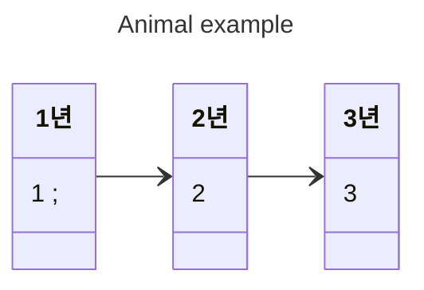
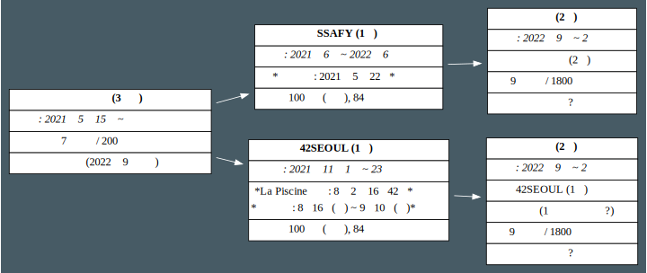
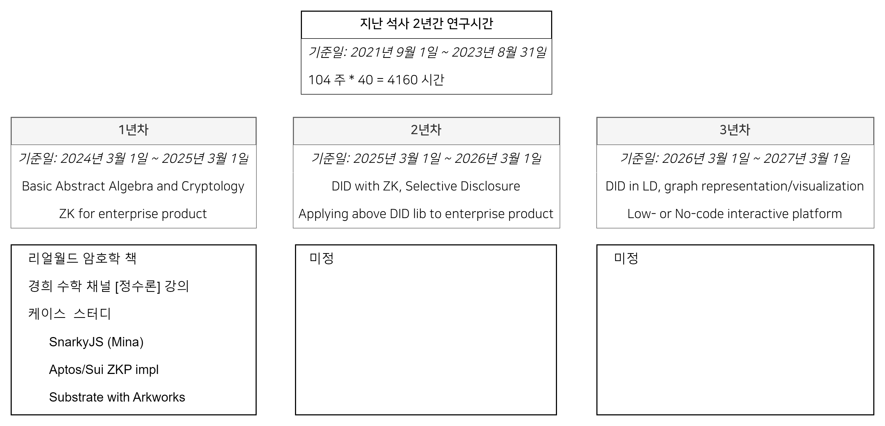

<!-- uncover or gaia or base-theme -->
<!--  -->
<!--header: Marps -->
    
    <!-- headingDivider: 2 -->

    <style>
    display: inline-block;
    text-align: center;
    vertical-align: middle;
    </style>


# Your slide deck

Start writing!

[슬라이드 링크](Untitled-1.html)


---

# **Marp**

Markdown Presentation Ecosystem

https://marp.app/

<!-- here is caption, for presentation note -->

---

# How to write slides

Split pages by horizontal ruler (`---`). It's very simple! :satisfied:

```markdown
# Slide 1

foobar

---

# Slide 2

foobar
```

---

# 🙌 
# 🖐 
# 👍
# 🙏
# 😁

---

# 🎇
# 👓
# 🕶
# 🤿
# 📞

---

# ☎
# 📡
# 📧
# ✉
# 📨

---

# 📫
# 📪
# 📬
# 📭
# 📮

---

# 🗳
# ❤
# 💌
# 🔆
# 💬


---

<!-- _class: slide invert -->




---
<div class="mermaid">

flowchart LR
  1년 --> 2년
  2년 --> 3년
  subgraph 3년
    direction LR
    계획3-1.
    계획3-2.
  end
  subgraph 2년
    direction LR
    계획2-1.
    계획2-2.
  end
  subgraph 1년
    direction LR
    계획1-1.
    계획1-2.
    계획1-3.
  end
</div>


  업무 외적으로 어떻게 성장할것인지, 
  가령 정수론 경희대 유투브 강의 같은 것들을 
  연차별로, 커리큘럼을 구체적으로 나열하는 편이 더 설득력이 있겠다. 
  테이블이나 그래프 적절한 표현방식을 사용하기.
  회사 기여는 이렇게 하고 싶습니다. 

---
<!-- _class: slide center invert -->

# 다이어그램



---

# 3년계획 다이어그램




---
<h4>질문 키워드</h4>

<ol>
  <li>암호학</li>
  <li>정수론</li>
  <li>케이스 스터디
    <ol>
      <li></li> 
      <li></li>
      <li></li>
    </ol>
  </li>
</ol>

12분, 36분의 중요성, 5일이면 3시간을 만든다.  
시간 하베스팅.  
